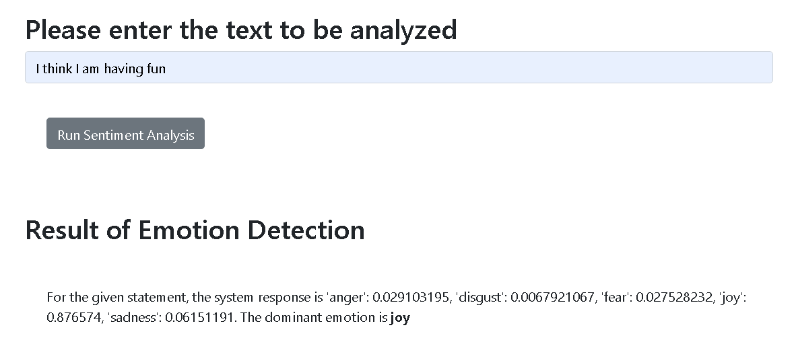

# Deploying AI Applications with Python and Flask

A Flask-based AI web application that uses **IBM Watson NLP** to perform **sentiment analysis** on user-provided text.  
This project was developed as part of an **Embedded AI / IBM Skills Network** practice assignment.

---

## Project Overview

This project demonstrates how to design, build, and deploy an **AI-powered web application** using Python and Flask.  
Users can enter text through a web interface, and the system returns the detected sentiment along with a confidence score using IBM Watson NLP.

The project emphasizes **real-world AI deployment practices**, including modular design, error handling, testing, and static code analysis.

---

## Key Features

- AI-based sentiment analysis using IBM Watson NLP  
- Web application deployment with Flask  
- Modular Python package structure  
- Robust error handling for invalid input and API failures  
- Unit testing for application logic  
- Static code analysis using Pylint  

---

## Technologies Used

- **Python 3.11**
- **Flask**
- **IBM Watson NLP**
- HTML / JavaScript
- Pylint (static code analysis)

---

### Emotion Detection Result

The screenshot below shows the emotion detection output generated by the application for a sample input text.

